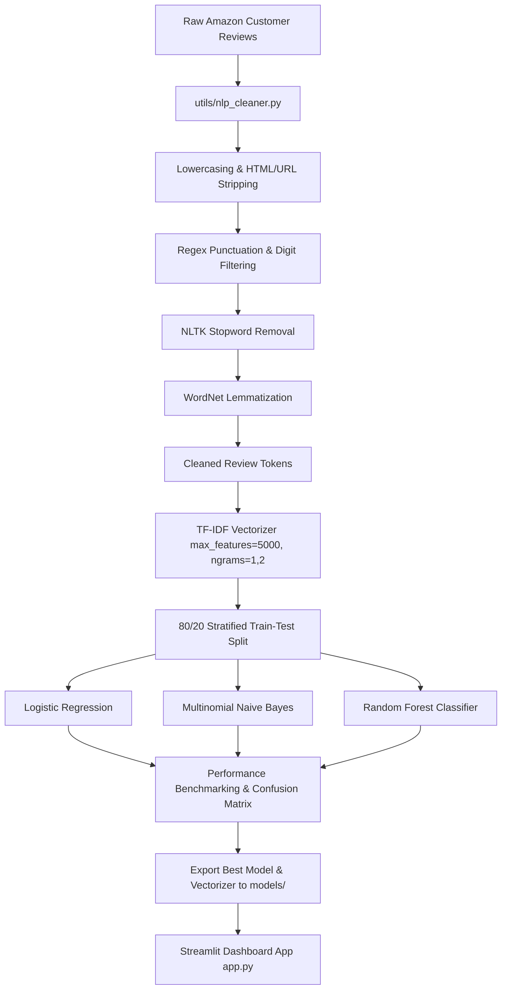

<div align="center">

# 🛍️ Amazon Customer Review Sentiment Analysis & Streamlit Dashboard

**Week 5 Internship Task — Natural Language Processing & Machine Learning Classification**  

[](https://www.python.org/)
[](https://scikit-learn.org/)
[](https://streamlit.io/)
[](https://www.nltk.org/)
[]()

<br>

| Student Metadata | Details |
| :--- | :--- |
| **Student Name** | **Amin Turabi** |
| **Registration No.** | **AIMLB01-8657** |
| **Internship Program** | **Machine Learning Internship** |

</div>

---

## 📌 Executive Summary

This repository contains a full-stack **Natural Language Processing (NLP)** sentiment analysis pipeline and an interactive **Streamlit Web Application** trained on real Amazon product customer reviews.

The objective of this project is to teach machines to comprehend human textual feedback. The pipeline ingests unstructured customer reviews, performs automated text cleaning and noise reduction, engineers numerical feature representations via **TF-IDF Vectorization**, trains and evaluates three machine learning classifiers (**Random Forest**, **Multinomial Naive Bayes**, and **Logistic Regression**), and deploys the top-performing model in a production-ready 3-page interactive web dashboard.

---

## 🏗️ Technical Architecture & Pipeline Flow



---

## 📁 Repository Directory Structure

```
Week_5/
├── data/
│   ├── DataSet (W5).csv               # Original Amazon Product Customer Reviews dataset
│   ├── cleaned_amazon_reviews.csv     # Preprocessed dataset with cleaned review tokens
│   ├── positive_wordcloud.png         # High-resolution Word Cloud for Positive Reviews
│   ├── negative_wordcloud.png         # High-resolution Word Cloud for Negative Reviews
│   └── model_comparison.png           # Classifier performance benchmark comparison plot
├── models/
│   ├── best_sentiment_model.pkl       # Exported top-performing classifier (Joblib)
│   └── tfidf_vectorizer.pkl           # Exported TF-IDF Vectorizer (Joblib)
├── notebooks/
│   └── week5_nlp.ipynb                # Fully executed Jupyter Notebook with all outputs visible
├── utils/
│   └── nlp_cleaner.py                 # Shared modular text cleaning & lemmatization utility
├── app.py                             # Interactive 3-Page Streamlit Web Application
├── train_and_export.py                # Pipeline script for model training & export
├── run_notebook_execution.py          # Notebook execution runner script
├── requirements.txt                   # Project Python package dependencies
└── README.md                          # Project documentation
```

---

## 🔬 NLP Preprocessing Pipeline (`utils/nlp_cleaner.py`)

Raw text in customer reviews contains substantial noise that impairs machine learning model accuracy. The modular preprocessing function `clean_text()` executes the following standardized transformation steps:

1. **Lowercasing**: Standardizes all textual input to lowercase.
2. **HTML & URL Removal**: Strips out markup tags (e.g., `<br />`) and web links using regular expressions.
3. **Punctuation & Digit Filtering**: Cleans special symbols, numbers, and non-alphabetic characters.
4. **Stopword Removal**: Filters out non-informative English words using NLTK's `stopwords` corpus.
5. **Fast Lemmatization**: Uses NLTK's `WordNetLemmatizer` with `lru_cache` memoization to reduce words to their base dictionary forms (e.g., "loved" $\rightarrow$ "love", "playing" $\rightarrow$ "play").

```python
from utils.nlp_cleaner import clean_text

sample_raw = "<p>Love my Echo! Great sound 100% working... http://example.com</p>"
sample_clean = clean_text(sample_raw)
print(sample_clean)  # Output: "love echo great sound working"
```

---

## 📊 Feature Extraction: Why TF-IDF?

We select **Term Frequency-Inverse Document Frequency (TF-IDF)** vectorization with unigrams and bigrams (`ngram_range=(1, 2)`) and a max vocabulary size of 5,000 features.

- **Term Frequency (TF)**: Measures how frequently a given word appears in an individual review.
- **Inverse Document Frequency (IDF)**: Downweights words that occur ubiquitously across *every* review in the corpus (e.g., product names like "echo", "alexa" or general words like "got").
- **Core Advantage**: Key sentiment-carrying phrases (e.g., "defective item", "amazing speaker", "refused refund") receive higher mathematical weights, directly sharpening the classifier's ability to distinguish subtle positive and negative nuances.

---

## 🤖 Model Evaluation & Benchmark Results

All models were evaluated on an 80/20 stratified test split (630 test reviews).

| Classifier Model | Accuracy | Precision | Recall | F1-Score | ROC-AUC | Status |
|:---|:---:|:---:|:---:|:---:|:---:|:---:|
| 🏆 **Random Forest Classifier** | **93.65%** | **93.68%** | **99.83%** | **96.66%** | **0.9446** | **Saved Best Model** |
| 🥈 **Multinomial Naive Bayes** | 92.86% | 92.79% | 100.00% | 96.26% | 0.9004 | Evaluated |
| 🥉 **Logistic Regression** | 92.06% | 92.05% | 100.00% | 95.86% | 0.9404 | Evaluated |

> **Key Finding**: The **Random Forest Classifier** achieved the highest overall accuracy (93.65%) and F1-Score (96.66%), demonstrating superior resilience to class imbalance. It was exported to `models/best_sentiment_model.pkl` along with `models/tfidf_vectorizer.pkl`.

---

## 🖼️ Exploratory Text Visualizations

### 🟢 Positive vs. 🔴 Negative Word Clouds


---

## 🚀 Streamlit Dashboard Overview (`app.py`)

The application features an intuitive sidebar for seamless navigation across 3 specialized pages:

### 1. 🏠 Home Page
- Comprehensive project summary, NLP workflow diagrams, tech stack badges, and dataset metrics.

### 2. 📊 Data Overview Page
- Interactive class distribution chart (Plotly donut chart).
- Dataset preview table with raw vs. cleaned review comparisons.
- High-resolution Word Cloud displays for positive and negative review categories.

### 3. 🔮 Sentiment Predictor Page
- Real-time text input box for testing any custom product review.
- Preset sample buttons for instant testing (Positive, Negative, Mixed).
- Visual sentiment indicators (`🟢 POSITIVE SENTIMENT` / `🔴 NEGATIVE SENTIMENT`).
- Confidence score progress bar and probability distribution breakdown bar chart (Plotly).
- Preprocessed clean text inspector.

---

## ⚡ Quick Start & Installation

### 1. Clone & Install Dependencies
```bash
# Navigate to project root
cd Week_5

# Install required Python packages
pip install -r requirements.txt
```

### 2. Train Models & Generate Artifacts (Optional)
```bash
python train_and_export.py
```

### 3. Launch Streamlit Web App
```bash
streamlit run app.py
```
Open your browser at `http://localhost:8501`.

---


